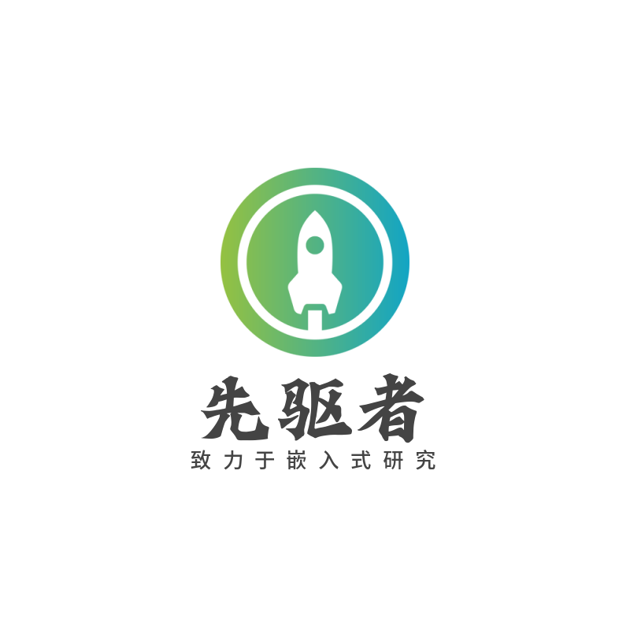

# 猫咪饮水机

为了解决铲屎官给猫猫喂水的烦恼而设计

<!-- PROJECT SHIELDS -->

[![Contributors][contributors-shield]][contributors-url]
[![Forks][forks-shield]][forks-url]
[![Stargazers][stars-shield]][stars-url]
[![Issues][issues-shield]][issues-url]
[![MIT License][license-shield]][license-url]
[![LinkedIn][linkedin-shield]][linkedin-url]

<!-- PROJECT LOGO -->
<br />

<p align="center">
    <a href="https://github.com/qi-ling-er/Cat_Drinking_Machine">
    
  </a>
  <h3 align="center">支持两种模式，随心切换</h3>
  <p align="center">
    一种模式为感应模式，一种为定时供水模式。感应模式即感应到猫咪即可自动供水，定时供水模式即设定好间隔时间和供水时间自动供水。
    <br />
    <a href="https://github.com/qi-ling-er/Cat_Drinking_Machine/blob/main/readme/%E4%BD%BF%E7%94%A8%E8%AF%B4%E6%98%8E.docx"><strong>使用说明 »</strong></a>
    <br />
    <br />
    <a href="https://github.com/qi-ling-er/Cat_Drinking_Machine/blob/main/readme/%E8%AE%BE%E8%AE%A1%E5%9B%BE.docx">设计图</a>
    ·
    <a href="https://github.com/qi-ling-er/Cat_Drinking_Machine/blob/main/readme/STM32F103C8T6%E5%BC%95%E8%84%9A%E5%AE%9A%E4%B9%89.xlsx">芯片引脚定义表</a>
    ·
    <a href="https://github.com/qi-ling-er/Cat_Drinking_Machine/blob/main/readme/%E5%AE%9E%E7%89%A9%E5%9B%BE.pptx">实物图</a>
  </p>

</p>


 
 
## 目录

- [上手指南](#上手指南)
  - [开发版型号](#开发板型号)
  - [Keil安装步骤](#Keil安装步骤)
- [文件目录说明](#文件目录说明)
- [硬件架构](#硬件架构)
- [开发环境部署](#开发环境部署)
- [使用到的框架](#使用到的框架)
- [贡献者](#贡献者)
  - [如何参与开源项目](#如何参与开源项目)
- [版本控制](#版本控制)
- [作者](#作者)
- [鸣谢](#鸣谢)

### 上手指南

主要介绍硬件的组装


###### 开发板型号

1. stm32f103c8t6最小系统板

###### **Keil安装步骤**

1. 本文档为参考别人的文档 [https://blog.csdn.net/weixin_44543463/article/details/120535830](https://blog.csdn.net/weixin_44543463/article/details/120535830)

```sh
git clone https://github.com/shaojintian/Best_README_template.git
```

### 文件目录说明
eg:

```
filetree

├── /DebugConfig/
├── /HEX/
├── /Hardware/
│  ├── Elect.c
│  ├── Elect.h
│  ├── FM.c
│  ├── FM.h
│  ├── HCSR501.c
│  ├── HCSR501.h
│  ├── Key.c
│  └── Key.h
├── /Library/
│  ├── misc.c
│  ├── misc.h
│  ├── stm32f10x_adc.c
│  ├── stm32f10x_adc.h
│  ├── stm32f10x_bkp.c
│  ├── stm32f10x_bkp.h
│  ├── stm32f10x_can.c
│  ├── stm32f10x_can.h
│  ├── stm32f10x_cec.c
│  ├── stm32f10x_cec.h
│  ├── stm32f10x_crc.c
│  ├── stm32f10x_crc.h
│  ├── stm32f10x_dac.c
│  ├── stm32f10x_dac.h
│  ├── stm32f10x_dbgmcu.c
│  ├── stm32f10x_dbgmcu.h
│  ├── stm32f10x_dma.c
│  ├── stm32f10x_dma.h
│  ├── stm32f10x_exti.c
│  ├── stm32f10x_exti.h
│  ├── stm32f10x_flash.c
│  ├── stm32f10x_flash.h
│  ├── stm32f10x_fsmc.c
│  ├── stm32f10x_fsmc.h
│  ├── stm32f10x_gpio.c
│  ├── stm32f10x_gpio.h
│  ├── stm32f10x_i2c.c
│  ├── stm32f10x_i2c.h
│  ├── stm32f10x_iwdg.c
│  ├── stm32f10x_iwdg.h
│  ├── stm32f10x_pwr.c
│  ├── stm32f10x_pwr.h
│  ├── stm32f10x_rcc.c
│  ├── stm32f10x_rcc.h
│  ├── stm32f10x_rtc.c
│  ├── stm32f10x_rtc.h
│  ├── stm32f10x_sdio.c
│  ├── stm32f10x_sdio.h
│  ├── stm32f10x_spi.c
│  ├── stm32f10x_spi.h
│  ├── stm32f10x_tim.c
│  ├── stm32f10x_tim.h
│  ├── stm32f10x_usart.c
│  ├── stm32f10x_usart.h
│  ├── stm32f10x_wwdg.c
│  └── stm32f10x_wwdg.h
├── /Listings/
├── /Objects/
├── /Picture/
├── /Start/
│  ├── core_cm3.c
│  ├── core_cm3.h
│  ├── startup_stm32f10x_cl.s
│  ├── startup_stm32f10x_hd.s
│  ├── startup_stm32f10x_hd_vl.s
│  ├── startup_stm32f10x_ld.s
│  ├── startup_stm32f10x_ld_vl.s
│  ├── startup_stm32f10x_md.s
│  ├── startup_stm32f10x_md_vl.s
│  ├── startup_stm32f10x_xl.s
│  ├── stm32f10x.h
│  ├── system_stm32f10x.c
│  └── system_stm32f10x.h
├── /System/
│  ├── Delay.c
│  └── Delay.h
├── /User/
│  ├── Fixed_time_mode.c
│  ├── Fixed_time_mode.h
│  ├── main.c
│  ├── stm32f10x_conf.h
│  ├── stm32f10x_it.c
│  └── stm32f10x_it.h
├── /readme/
│  ├── STM32F103C8T6引脚定义.xlsx
│  ├── 设计图.docx
│  ├── 实物图.pptx
│  └── 使用说明.docx
├── README.md
├── keilkill.bat
├── project.uvguix.21424
├── project.uvguix.Mxl
├── project.uvoptx
├── project.uvprojx

```


### 硬件架构 

请阅读[ARCHITECTURE.md](https://github.com/shaojintian/Best_README_template/blob/master/ARCHITECTURE.md) 查阅为该项目的架构。

### 开发环境部署

暂无

### 使用到的框架

- [xxxxxxx](https://getbootstrap.com)
- [xxxxxxx](https://jquery.com)
- [xxxxxxx](https://laravel.com)

### 贡献者

请阅读**CONTRIBUTING.md** 查阅为该项目做出贡献的开发者。

#### 如何参与开源项目

贡献使开源社区成为一个学习、激励和创造的绝佳场所。你所作的任何贡献都是**非常感谢**的。


1. Fork the Project
2. Create your Feature Branch (`git checkout -b feature/AmazingFeature`)
3. Commit your Changes (`git commit -m 'Add some AmazingFeature'`)
4. Push to the Branch (`git push origin feature/AmazingFeature`)
5. Open a Pull Request


### 版本控制

该项目使用Git进行版本管理。您可以在repository参看当前可用版本。

### 作者

xxx@xxxx

知乎:xxxx  &ensp; qq:xxxxxx    

 *您也可以在贡献者名单中参看所有参与该项目的开发者。*

### 版权说明

该项目签署了MIT 授权许可，详情请参阅 [LICENSE.txt](https://github.com/shaojintian/Best_README_template/blob/master/LICENSE.txt)

### 鸣谢


- [GitHub Emoji Cheat Sheet](https://www.webpagefx.com/tools/emoji-cheat-sheet)
- [Img Shields](https://shields.io)
- [Choose an Open Source License](https://choosealicense.com)
- [GitHub Pages](https://pages.github.com)
- [Animate.css](https://daneden.github.io/animate.css)
- [xxxxxxxxxxxxxx](https://connoratherton.com/loaders)

<!-- links -->
[your-project-path]:shaojintian/Best_README_template
[contributors-shield]: https://img.shields.io/github/contributors/shaojintian/Best_README_template.svg?style=flat-square
[contributors-url]: https://github.com/shaojintian/Best_README_template/graphs/contributors
[forks-shield]: https://img.shields.io/github/forks/shaojintian/Best_README_template.svg?style=flat-square
[forks-url]: https://github.com/shaojintian/Best_README_template/network/members
[stars-shield]: https://img.shields.io/github/stars/shaojintian/Best_README_template.svg?style=flat-square
[stars-url]: https://github.com/shaojintian/Best_README_template/stargazers
[issues-shield]: https://img.shields.io/github/issues/shaojintian/Best_README_template.svg?style=flat-square
[issues-url]: https://img.shields.io/github/issues/shaojintian/Best_README_template.svg
[license-shield]: https://img.shields.io/github/license/shaojintian/Best_README_template.svg?style=flat-square
[license-url]: https://github.com/shaojintian/Best_README_template/blob/master/LICENSE.txt
[linkedin-shield]: https://img.shields.io/badge/-LinkedIn-black.svg?style=flat-square&logo=linkedin&colorB=555
[linkedin-url]: https://linkedin.com/in/shaojintian
